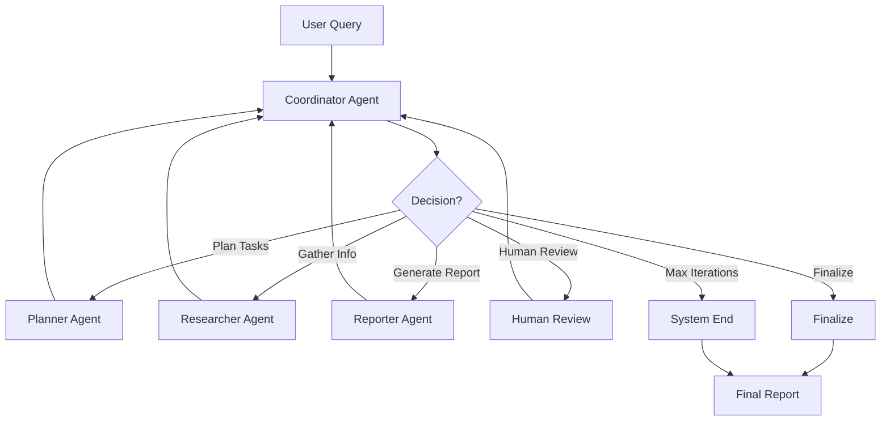

# Multi-Agent Deep Research System

An AI-powered research assistant that uses **multiple collaborating agents** to automate research planning, information retrieval, and report generation.

## 📋 Table of Contents

- [Features](#features)
- [System Architecture](#system-architecture)
- [Installation](#installation)
- [Usage](#usage)
- [Examples](#examples)
- [Dependencies](#dependencies)
- [Contributing](#contributing)
- [License](#license)

## ✨ Features

- **Intelligent Coordinator** - Smart decision-maker that dynamically routes to the most appropriate agent
- **Research Planning** - Automatically decomposes complex user queries into structured research tasks
- **Multi-Source Information Retrieval** - Collects relevant information from web search engines and academic databases (Serper, Tavily, arXiv)
- **Knowledge Synthesis** - Summarizes and integrates information into clear insights using Google Gemini
- **Automated Report Generation** - Produces structured research reports with key findings and analysis
- **Human-in-the-Loop Review** - Allows users to review, provide feedback, and refine generated reports
- **Incremental Research** - Research results can be appended instead of overwritten when tasks are repeated
- **Loop Protection** - Prevents infinite loops with configurable maximum call limits
- **Call History Tracking** - Records all agent calls for debugging and analysis
- **Prompt Debugging** - Option to print all prompts sent to models for testing
- **Markdown Report Output** - Saves research findings in well-structured Markdown files

## 🏗️ System Architecture

The system is built on a **dynamic multi-agent architecture** using LangGraph, with a smart Coordinator Agent that makes intelligent routing decisions:



### Agent Responsibilities

- **Coordinator Agent** - Intelligent decision-maker that analyzes current state and decides next agent to call
- **Planner Agent** - Breaks down research queries into specific, actionable tasks
- **Researcher Agent** - Executes tasks using various tools (web search, academic databases)
- **Reporter Agent** - Generates comprehensive research reports from collected information
- **Human Review** - Allows users to review and provide feedback on reports
- **Finalize** - Completes the research process with approved report
- **System End** - Graceful termination when maximum iterations are reached

### Key Features

- **Dynamic Routing** - Coordinator makes flexible decisions based on current state
- **Loop Protection** - Prevents infinite loops with maximum call limits (default: 20)
- **Incremental Research** - Research results can be appended instead of overwritten
- **Call History** - Records all agent calls for debugging and analysis
- **Prompt Debugging** - Option to print all prompts sent to models

### Workflow

1. **Coordinator** analyzes the current state
2. **Coordinator** selects the most appropriate next agent
3. **Selected agent** performs its task
4. **Flow returns** to Coordinator for next decision
5. **Process repeats** until report is finalized or max iterations reached

## 🚀 Installation

### Prerequisites

- Python 3.8 or higher
- Conda (recommended for environment management)
- API keys for:
  - Google Gemini API
  - Serper API (for web search)
  - Tavily API (for web search)

### Steps using Conda (Recommended)

1. **Clone the repository**
   ```bash
   git clone https://github.com/yourusername/multi-agent-research.git
   cd multi-agent-research
   ```

2. **Create and activate a Conda environment**
   ```bash
   # Create a new environment
   conda create -n multi-agent-research python=3.10
   
   # Activate the environment
   conda activate multi-agent-research
   ```

3. **Install dependencies**
   ```bash
   pip install -r requirements.txt
   ```

4. **Set up API keys**
   - Add your API keys to the `agent.py` file or set them as environment variables:
     
     **For Windows (Command Prompt):**
     ```cmd
     set GOOGLE_API_KEY=your_google_api_key
     set SERPER_API_KEY=your_serper_api_key
     set TAVILY_API_KEY=your_tavily_api_key
     ```
     
     **For Windows (PowerShell):**
     ```powershell
     $env:GOOGLE_API_KEY = "your_google_api_key"
     $env:SERPER_API_KEY = "your_serper_api_key"
     $env:TAVILY_API_KEY = "your_tavily_api_key"
     ```

### Steps using Virtual Environment (Alternative)

1. **Clone the repository**
   ```bash
   git clone https://github.com/yourusername/multi-agent-research.git
   cd multi-agent-research
   ```

2. **Create and activate a virtual environment**
   ```bash
   # Create a new virtual environment
   python -m venv venv
   
   # Activate the environment (Windows)
   venv\Scripts\activate
   ```

3. **Install dependencies**
   ```bash
   pip install -r requirements.txt
   ```

4. **Set up API keys**
   - Follow the same steps as in the Conda installation section

## 📖 Usage

### Basic Usage

Run the main script to start the research process:

```bash
python main.py
```

You will be prompted to enter your research query.

### Command Line Options

- **Use a random query** from `queries.txt`:
  ```bash
  python main.py -r
  ```

- **Specify a query** directly:
  ```bash
  python main.py -q "Your research query here"
  ```

### Output

Generated reports are saved in the `reports/` directory as Markdown files with filenames based on your query.

## 📊 Examples

### Example Query

```bash
python main.py -q "How Brain-Computer Interfaces Could Change Human-Computer Interaction?"
```

### Example Output

The system will generate a structured Markdown report with sections including:
- Executive Summary
- Key Findings
- Analysis
- Future Directions
- Conclusion

## 📦 Dependencies

See [requirements.txt](requirements.txt) for a complete list of dependencies.

## 📄 License

This project is licensed under the MIT License - see the [LICENSE](LICENSE) file for details.

## 🙏 Acknowledgments

- [LangGraph](https://github.com/langchain-ai/langgraph) - For the agent orchestration framework
- [Google Gemini](https://ai.google.dev/) - For the generative AI capabilities
- [Serper](https://serper.dev/) - For web search functionality
- [Tavily](https://tavily.com/) - For web search functionality
- [arXiv](https://arxiv.org/) - For academic paper search
